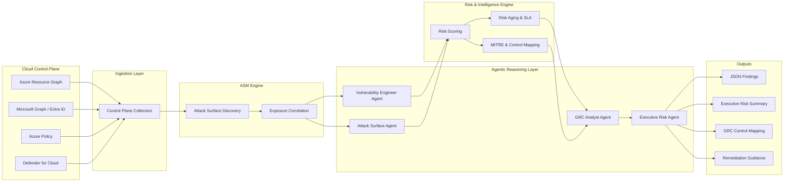

# SentinelForge AI

**SentinelForge AI** is an **agentic, agentless cloud security platform** designed to evaluate cloud control-plane risk with the mindset of a **Senior Vulnerability Engineer and GRC Analyst**.

The platform performs **API-based, agentless security analysis** of cloud environments (starting with **Microsoft Azure**) and forges raw configuration, identity, and posture signals into **actionable vulnerability intelligence, risk prioritization, and GRC-aligned insights**.

> SentinelForge AI does not replace engineers — it *thinks like one*.

---

## 🚀 Why SentinelForge AI Exists

Modern cloud environments suffer from three core problems:

1. **Too much noise** from posture tools and scanners
2. **Not enough context** for exploitability, ownership, and business risk
3. **Poor GRC translation** between technical findings and compliance expectations

SentinelForge AI was built to solve this gap by combining:

* Agentless cloud telemetry
* AI-powered security reasoning
* Vulnerability management best practices
* Governance, Risk, and Compliance (GRC) alignment

---

## 🧠 Core Design Principles

---

## 🏗️ Architecture Diagram (v1)

The SentinelForge AI architecture is designed around **agentless control-plane ingestion**, **continuous attack surface discovery**, and **agentic security reasoning**.



---

* **Agentless First** – No host agents, no performance impact
* **Control Plane Focused** – Azure Resource Graph, Microsoft Graph, and policy APIs
* **AI-Native** – Findings are interpreted by agentic security personas
* **GRC-Aware** – Every finding maps to security controls and risk frameworks
* **JSON-First** – Machine-readable output for pipelines, dashboards, and SIEMs

---

## 🛰️ Attack Surface Management (ASM)

SentinelForge AI includes **cloud-native Attack Surface Management** to continuously identify and assess **externally reachable and high-risk cloud assets** — without deploying agents.

### ASM Capabilities (Azure – Phase 1)

* Discovery of **public-facing resources** (VMs, IPs, load balancers)
* Identification of **internet-exposed services** (RDP, SSH, management ports)
* Detection of **over-permissive network rules** (e.g., `0.0.0.0/0`)
* Correlation of **identity exposure + network exposure**
* Prioritization of assets most likely to be targeted by attackers

ASM findings are **correlated with vulnerability, identity, and GRC context** so teams understand not just *what is exposed*, but *why it matters*.

---

## 🏗️ Architecture Overview

SentinelForge AI follows a **cloud‑native, agentless architecture** designed to surface real attack paths, prioritize risk, and translate technical findings into GRC‑ready outcomes.

### 1) Control Plane Ingestion (Read‑Only)

SentinelForge AI connects to Azure using **API‑only, read‑only access**—no host agents, no performance impact.

* **Azure Resource Graph** – inventory, configuration, posture
* **Microsoft Graph / Entra ID** – identities, roles, permissions
* **Azure Policy** – compliance state and drift
* **Defender for Cloud (signals)** – supplemental security context

### 2) Agentless ASM & Discovery

The platform continuously discovers **externally reachable and high‑risk assets** across the control plane:

* Public IPs, endpoints, and services
* Internet‑exposed management ports (RDP/SSH)
* Over‑permissive network rules (e.g., `0.0.0.0/0`)
* Identity exposure correlated with network exposure

### 3) Cloud Exposure Map

Discovered assets are normalized into a **Cloud Exposure Map** that represents how attackers could realistically reach resources.

* Asset relationships (identity ↔ network ↔ data)
* Exposure context (public, restricted, internal)
* Signals used to infer **attack‑path potential**

### 4) Agent Reasoning Loop

Multiple AI agents analyze the exposure map in a continuous reasoning loop:

* **Sentinel Agent** – vulnerability detection and attack surface analysis
* **Forge Agent** – risk scoring, threat correlation, and prioritization
* **GRC Agent** – control mapping, audit impact, and compliance posture

The **AI Core** orchestrates context sharing, deduplication, and explainable decisions.

### 5) Risk & GRC Outputs

Findings are produced in both **machine‑readable** and **executive‑ready** formats:

* Risk dashboards and trends
* GRC reports (NIST CSF, CIS, ISO 27001)
* Executive summaries with business impact and SLA context

---

## 🤖 Agentic Architecture

SentinelForge AI is powered by multiple AI agents, each representing a senior security function:

### 🧑‍💻 Vulnerability Engineer Agent

* Interprets cloud findings
* Removes false positives
* Evaluates exploitability and exposure
* Applies risk aging logic

### 🧑‍⚖️ GRC Analyst Agent

* Maps findings to:

  * NIST CSF
  * ISO 27001
  * CIS Azure Benchmark
* Identifies control gaps
* Flags audit and compliance risk

### 🛰️ Attack Surface Agent

* Identifies externally reachable assets
* Correlates exposure with identity and configuration risk
* Flags assets with high likelihood of exploitation
* Feeds prioritization into risk scoring and SLA logic

### 🧠 Executive Risk Agent

* Translates technical risk into business language
* Produces board- and audit-ready summaries
* Highlights top risks that matter *now*

---

## ☁️ Phase 1: Azure Edition (MVP)

SentinelForge AI currently focuses on **Microsoft Azure**, using a fully agentless approach.

### Data Sources

* Azure Resource Graph
* Microsoft Graph (Entra ID)
* Azure Policy
* Microsoft Defender for Cloud (read-only signals)

### Detection Categories

#### 🔐 Identity & Access Risk

* Over-privileged roles (Global Admin sprawl)
* Guest accounts with elevated access
* Stale users and service principals
* MFA gaps on privileged identities

#### 🖥️ Compute & Network Exposure

* Publicly exposed virtual machines
* NSGs allowing unrestricted ingress
* RDP / SSH exposure
* Missing Defender or encryption controls

#### 🗄️ Storage & Data Exposure

* Public blob containers
* Missing private endpoints
* No soft delete or immutability
* Encryption misconfigurations

#### 🛰️ Attack Surface Exposure

* Public IPs and endpoints
* Internet-facing management ports
* Overly permissive NSG rules
* Unprotected external services

#### ⚙️ Security Control Drift

* Azure Policy non-compliance
* Disabled Defender plans
* Logging and monitoring gaps

---

## 📊 Output & Artifacts

### Machine-Readable

* JSON findings
* Risk scores
* SLA and risk aging metrics
* MITRE ATT&CK technique mapping
* Control framework mappings

### Human-Readable

* Executive risk summaries
* Top risk dashboards
* GRC alignment tables
* Prioritized remediation guidance

---

## 🧱 Repository Structure (Planned)

```
sentinelforge-ai/
│
├── collectors/
│   ├── azure_identity.py
│   ├── azure_compute.py
│   ├── azure_network.py
│   ├── azure_storage.py
│
├── agents/
│   ├── vuln_engineer_agent.py
│   ├── grc_agent.py
│   ├── exec_agent.py
│
├── schemas/
│   ├── finding.schema.json
│
├── risk_engine/
│   ├── scoring.py
│   ├── risk_aging.py
│
├── mappings/
│   ├── nist_csf.yaml
│   ├── cis_azure.yaml
│
└── README.md
```

---

## 🔮 Roadmap

* Azure MVP detections
* Risk scoring and SLA logic
* GRC control mapping expansion
* Executive reporting engine
* AWS and GCP support
* Multi-cloud security graph

---

## 🎯 Intended Audience

* Security Engineers
* Vulnerability Management Teams
* GRC & Compliance Teams
* Cloud Security Architects
* CISOs and Security Leadership

---

## ⚠️ Disclaimer

SentinelForge AI is a **research and portfolio project** intended to demonstrate modern cloud security engineering, agentic AI workflows, and GRC-aware vulnerability management concepts. It is not a commercial security product.

---

## 🛡️ Final Note

SentinelForge AI represents a vision of **how cloud security should work**:

* Less noise
* More context
* Clear risk ownership
* Engineer-first intelligence

> *Forge security intelligence. Guard what matters.*


---


